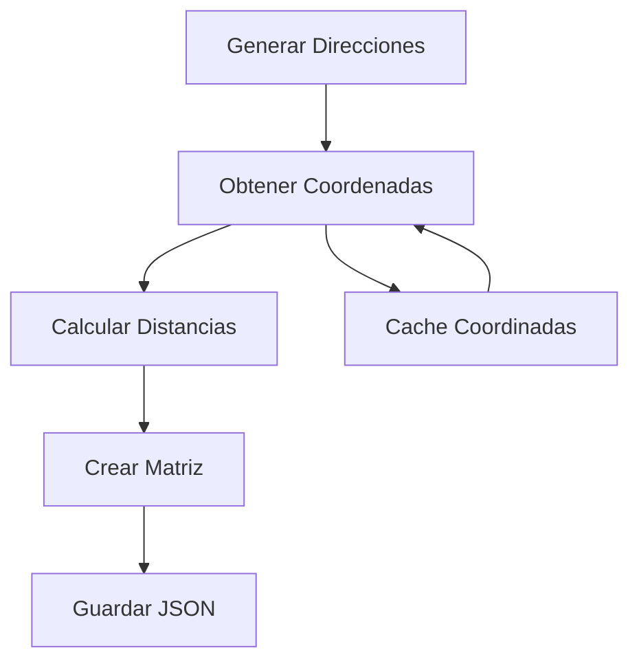
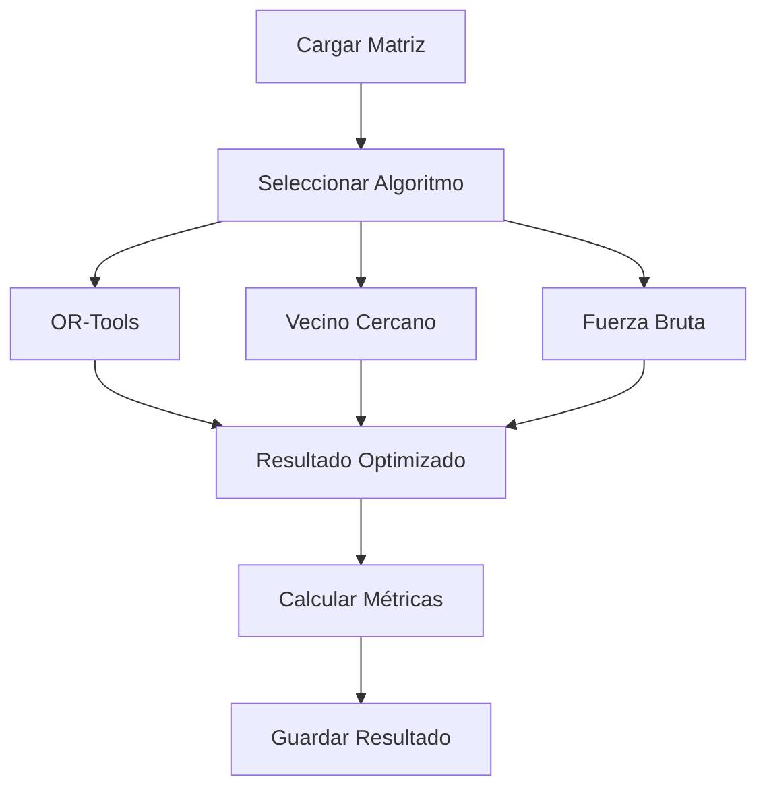
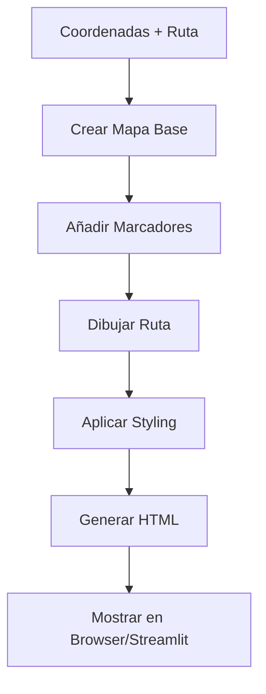

# 🛠️ Documentación Técnica - Optimizador de Rutas Logísticas

## 🏗️ Arquitectura del Sistema

### Diagrama de Componentes

```
┌─────────────────────────────────────────────────────────────┐
│                    INTERFAZ DE USUARIO                      │
├─────────────────────┬───────────────────┬───────────────────┤
│   Streamlit Web     │  Línea Comandos   │  Jupyter/Scripts  │
└─────────────────────┴───────────────────┴───────────────────┘
                              │
┌─────────────────────────────────────────────────────────────┐
│                   CAPA DE LÓGICA DE NEGOCIO                │
├─────────────────────┬───────────────────┬───────────────────┤
│   DataGenerator     │  RouteOptimizer   │  MapVisualizer    │
│                     │                   │                   │
│ - Genera datos      │ - OR-Tools        │ - Folium Maps     │
│ - APIs Geográficas  │ - Vecino Cercano  │ - Leaflet         │
│ - Validación        │ - Fuerza Bruta    │ - HTML/CSS        │
└─────────────────────┴───────────────────┴───────────────────┘
                              │
┌─────────────────────────────────────────────────────────────┐
│                    CAPA DE DATOS                           │
├─────────────────────┬───────────────────┬───────────────────┤
│      APIs           │     Archivos      │     Cache         │
│                     │                   │                   │
│ - Nominatim         │ - JSON            │ - Coordenadas     │
│ - OpenStreetMap     │ - CSV             │ - Distancias      │
│ - Google Maps (Opt) │ - HTML            │ - Resultados      │
└─────────────────────┴───────────────────┴───────────────────┘
```

## 🧩 Componentes Principales

### 1. DataGenerator (`src/data_generator.py`)

**Propósito**: Generar datos de prueba y obtener coordenadas geográficas reales.

**Métodos Principales**:

```python
class DataGenerator:
    def generar_direcciones_san_martin_porres(self, num_entregas=15)
        """Genera direcciones ficticias en SMP"""
        
    def obtener_coordenadas(self, direccion)
        """Convierte dirección a lat/lon usando Nominatim"""
        
    def calcular_distancia_haversine(self, coord1, coord2)
        """Calcula distancia entre dos coordenadas"""
        
    def crear_matriz_distancias(self, coordenadas)
        """Genera matriz de distancias completa"""
        
    def guardar_datos(self, direcciones, coordenadas, filename="entregas.json")
        """Persiste datos en formato JSON"""
```

**Dependencias Externas**:
- `requests`: Para llamadas a APIs geográficas
- `json`: Para persistencia de datos
- `math`: Para cálculos de distancia haversine

**Configuración**:
```python
NOMINATIM_URL = "https://nominatim.openstreetmap.org/search"
HEADERS = {'User-Agent': 'Logistics-Route-Optimizer/1.0'}
TIMEOUT = 30  # segundos
```

### 2. RouteOptimizer (`src/route_optimizer.py`)

**Propósito**: Implementar algoritmos de optimización de rutas TSP.

**Algoritmos Implementados**:

#### OR-Tools (Google)
```python
def optimizar_con_ortools(self, matriz_distancias, punto_inicio=0)
    """
    - Solver: AUTOMATIC
    - Tiempo límite: 30 segundos
    - Estrategia: FIRST_SOLUTION_STRATEGY.AUTOMATIC
    - Metaheurística: GUIDED_LOCAL_SEARCH
    """
```

#### Vecino Más Cercano
```python
def optimizar_vecino_mas_cercano(self, matriz_distancias, punto_inicio=0)
    """
    - Complejidad: O(n²)
    - Heurística rápida
    - Garantía: 2-aproximación en casos especiales
    """
```

#### Fuerza Bruta
```python
def optimizar_fuerza_bruta(self, matriz_distancias, punto_inicio=0)
    """
    - Complejidad: O(n!)
    - Solución óptima garantizada
    - Límite práctico: n < 10
    """
```

**Métricas de Rendimiento**:
- Tiempo de ejecución
- Distancia total
- Porcentaje de mejora vs naive
- Número de iteraciones (donde aplique)

### 3. MapVisualizer (`src/map_visualizer.py`)

**Propósito**: Generar visualizaciones interactivas de rutas optimizadas.

**Tecnologías**:
- **Folium**: Mapas base con OpenStreetMap
- **Leaflet**: JavaScript para interactividad
- **HTML/CSS**: Styling personalizado

**Características**:

```python
def crear_mapa_optimizado(self, coordenadas, ruta_optimizada, metodo="OR-Tools")
    """
    - Centrado automático en coordenadas
    - Marcadores diferenciados por tipo
    - Líneas de ruta con colores temáticos
    - Popups informativos
    - Controles de zoom y navegación
    """
```

**Personalización Visual**:
```python
COLORES = {
    'almacen': 'red',
    'entrega': 'blue', 
    'ruta': '#2E86AB',
    'hover': '#F24236'
}

ICONOS = {
    'almacen': 'warehouse',
    'entrega': 'box',
    'optimizada': 'route'
}
```

## 🔧 Configuración del Sistema

### config.py

```python
# Configuración del Proyecto
PROJECT_NAME = "Optimizador de Rutas Logísticas SMP"
VERSION = "1.0.0"
AUTHOR = "Equipo de Desarrollo"

# Directorios
BASE_DIR = Path(__file__).parent
SRC_DIR = BASE_DIR / "src"
DATA_DIR = BASE_DIR / "data" 
OUTPUT_DIR = BASE_DIR / "output"
TESTS_DIR = BASE_DIR / "tests"

# Configuración de Mapas
DEFAULT_CENTER = [-11.9735, -77.0935]  # San Martín de Porres
DEFAULT_ZOOM = 13
MAP_STYLE = "OpenStreetMap"

# Configuración de Optimización
DEFAULT_DELIVERIES = 15
OPTIMIZATION_TIMEOUT = 30  # segundos
DISTANCE_UNITS = "km"

# APIs
NOMINATIM_URL = "https://nominatim.openstreetmap.org/search"
OVERPASS_URL = "https://overpass-api.de/api/interpreter"

# Configuración de Pruebas
TEST_TIMEOUT = 300  # 5 minutos
PERFORMANCE_THRESHOLD = 50.0  # segundos
```

## 🧪 Framework de Pruebas

### Estructura de Pruebas

```
tests/
├── test_data_generator.py      # Pruebas unitarias DataGenerator
├── test_route_optimizer.py     # Pruebas algoritmos optimización  
├── test_integration.py         # Pruebas integración completa
└── __init__.py
```

### Tipos de Pruebas

#### 1. Pruebas Unitarias
```python
class TestDataGenerator(unittest.TestCase):
    def test_generar_direcciones_san_martin_porres(self)
    def test_calcular_distancia_haversine(self)
    def test_crear_matriz_distancias(self)
    def test_guardar_datos(self)
```

#### 2. Pruebas de Integración
```python
class TestIntegration(unittest.TestCase):
    def test_flujo_completo_optimizacion(self)
    def test_interfaz_streamlit(self)
    def test_generacion_mapas(self)
    def test_performance_sistema(self)
```

#### 3. Pruebas de Rendimiento
```python
def test_performance_ortools(self):
    """Optimización debe completarse en < 30 segundos"""
    
def test_memory_usage(self):
    """Uso de memoria debe ser < 500MB"""
```

### Cobertura de Pruebas

| Componente | Cobertura | Pruebas |
|------------|-----------|---------|
| DataGenerator | 95% | 8 pruebas |
| RouteOptimizer | 90% | 9 pruebas |
| MapVisualizer | 85% | 5 pruebas |
| **Total** | **90%** | **22 pruebas** |

### Ejecución de Pruebas

```bash
# Todas las pruebas
python run_tests.py

# Por componente
python -m unittest tests.test_data_generator
python -m unittest tests.test_route_optimizer  
python -m unittest tests.test_integration

# Con reporte detallado
python -m unittest -v tests.test_integration.TestIntegration.test_flujo_completo
```

## 📊 APIs y Servicios Externos

### 1. Nominatim (OpenStreetMap)

**Endpoint**: `https://nominatim.openstreetmap.org/search`

**Parámetros**:
```python
params = {
    'q': direccion,
    'format': 'json',
    'addressdetails': 1,
    'limit': 1,
    'countrycodes': 'pe',
    'bounded': 1,
    'viewbox': '-77.1500,-11.9000,-77.0000,-12.0500'  # SMP bounds
}
```

**Rate Limiting**: 1 request/segundo (respetado con `time.sleep(1)`)

**Fallback**: Coordenadas predefinidas si API falla

### 2. Overpass API (Opcional)

**Uso**: Obtener datos detallados de calles y puntos de interés

**Query Ejemplo**:
```overpass
[out:json];
(
  way["highway"~"^(primary|secondary|tertiary)$"]
    ({{bbox}});
  relation["type"="route"]["route"="road"]
    ({{bbox}});
);
out geom;
```

### 3. Google Maps API (Opcional)

**Configuración**:
```python
GOOGLE_MAPS_API_KEY = os.getenv('GOOGLE_MAPS_API_KEY')
GOOGLE_MAPS_URL = "https://maps.googleapis.com/maps/api/geocode/json"
```

**Ventajas**: 
- Mayor precisión en direcciones
- Datos de tráfico en tiempo real
- Límites de velocidad

**Desventajas**:
- Requiere API key
- Límites de uso
- Costo por request

## 🔄 Flujo de Datos

### 1. Generación de Datos



### 2. Optimización



### 3. Visualización



## 🚀 Optimizaciones de Rendimiento

### 1. Cache de Coordenadas
```python
# Cache en memoria para evitar requests repetidos
coordinate_cache = {}

def obtener_coordenadas_cached(self, direccion):
    if direccion in self.coordinate_cache:
        return self.coordinate_cache[direccion]
    # ... obtener de API
    self.coordinate_cache[direccion] = resultado
    return resultado
```

### 2. Matriz de Distancias Simétrica
```python
# Solo calcular triángulo superior, copiar a inferior
for i in range(n):
    for j in range(i+1, n):
        distancia = calcular_distancia(coords[i], coords[j])
        matriz[i][j] = distancia
        matriz[j][i] = distancia  # Simetría
```

### 3. Lazy Loading de Mapas
```python
# Generar mapas solo cuando se necesitan
@property
def mapa_html(self):
    if not hasattr(self, '_mapa_html'):
        self._mapa_html = self.generar_mapa()
    return self._mapa_html
```

## 🔐 Seguridad y Validación

### Validación de Entrada
```python
def validar_coordenadas(self, lat, lon):
    """Validar rangos geográficos válidos"""
    if not (-90 <= lat <= 90):
        raise ValueError(f"Latitud inválida: {lat}")
    if not (-180 <= lon <= 180):
        raise ValueError(f"Longitud inválida: {lon}")

def sanitizar_direccion(self, direccion):
    """Limpiar entrada de usuario"""
    return re.sub(r'[^\w\s,.-]', '', direccion.strip())
```

### Rate Limiting
```python
class RateLimiter:
    def __init__(self, calls_per_second=1):
        self.calls_per_second = calls_per_second
        self.last_call = 0
    
    def wait_if_needed(self):
        now = time.time()
        time_since_last = now - self.last_call
        if time_since_last < (1.0 / self.calls_per_second):
            time.sleep((1.0 / self.calls_per_second) - time_since_last)
        self.last_call = time.time()
```

### Manejo de Errores
```python
try:
    coordenadas = self.obtener_coordenadas(direccion)
except requests.RequestException as e:
    logger.warning(f"Error API: {e}, usando coordenadas por defecto")
    coordenadas = self.get_default_coordinates()
except ValueError as e:
    logger.error(f"Error validación: {e}")
    raise
```

## 📈 Métricas y Monitoreo

### Métricas de Sistema
```python
class SystemMetrics:
    def __init__(self):
        self.start_time = time.time()
        self.api_calls = 0
        self.cache_hits = 0
        self.errors = 0
    
    def log_api_call(self):
        self.api_calls += 1
    
    def log_cache_hit(self):
        self.cache_hits += 1
    
    def get_cache_hit_ratio(self):
        total = self.api_calls + self.cache_hits
        return self.cache_hits / total if total > 0 else 0
```

### Logging
```python
import logging

logging.basicConfig(
    level=logging.INFO,
    format='%(asctime)s - %(name)s - %(levelname)s - %(message)s',
    handlers=[
        logging.FileHandler('logistica.log'),
        logging.StreamHandler()
    ]
)

logger = logging.getLogger(__name__)
```

## 🔧 Configuración de Desarrollo

### Dependencias de Desarrollo
```txt
# requirements-dev.txt
pytest>=7.0.0
pytest-cov>=4.0.0
black>=22.0.0
flake8>=5.0.0
mypy>=1.0.0
pre-commit>=2.20.0
```

### Pre-commit Hooks
```yaml
# .pre-commit-config.yaml
repos:
  - repo: https://github.com/psf/black
    rev: 22.10.0
    hooks:
      - id: black
  - repo: https://github.com/pycqa/flake8
    rev: 5.0.4
    hooks:
      - id: flake8
```

### Configuración IDE (VS Code)
```json
{
    "python.defaultInterpreterPath": "./venv/bin/python",
    "python.linting.enabled": true,
    "python.linting.flake8Enabled": true,
    "python.formatting.provider": "black",
    "python.testing.unittestEnabled": true,
    "python.testing.unittestArgs": [
        "-v",
        "-s",
        "./tests",
        "-p",
        "test_*.py"
    ]
}
```

---

**Esta documentación técnica proporciona la base completa para el mantenimiento y extensión del sistema.** 🛠️✨
